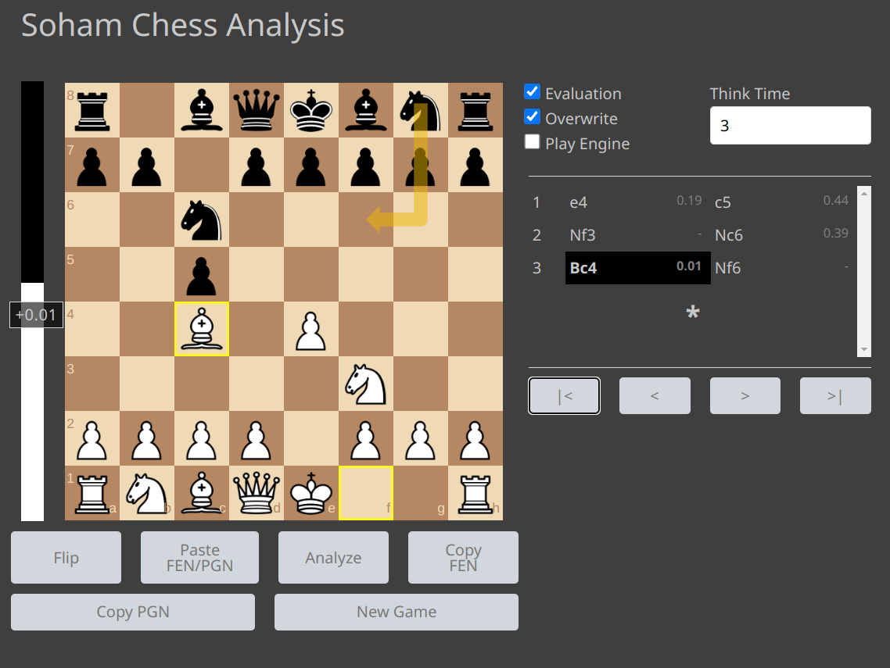

# Chess Analysis

This web application is a chess analysis tool that allows users to upload their chess games and analyze them using the Stockfish chess engine. The user can also play with the engine.

## Features
- Upload PGN files
- Analyze games
- Play with Stockfish
- Control time and depth of analysis
- Evaluation graph
- Annotate moves using arrows

## Libraries used
- stockfish.js
- chess.js
- chessboard.js

## How to run
1. Clone the repository
2. Open `index.html` in your browser

## Author
Soham Korade